## 1. Configuración del entorno

Se busca la creación de una web sencilla, con una api rest básica

- Inicializamos el proyecto de node


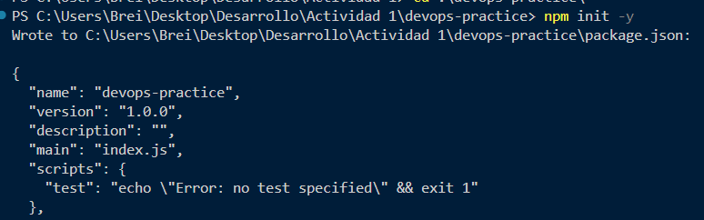

con esto ya tenemos la base del proyecto de node

- Dependencias

Necesitamos la dependencia de express y jest para la creación de la api y pruebas respectivamente

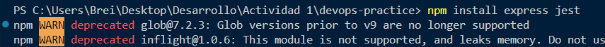

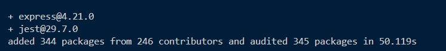

- Carpetas del proyecto

Creamos la carpeta y subcarpetas para la actividad

 ```javascript
 mkdir src tests
```

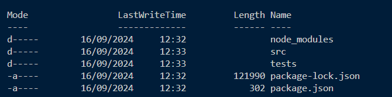

```javascript
touch src/app.js tests/app.test.js
```

- Implementación de la API REST

```javascript
 src/app.js
```
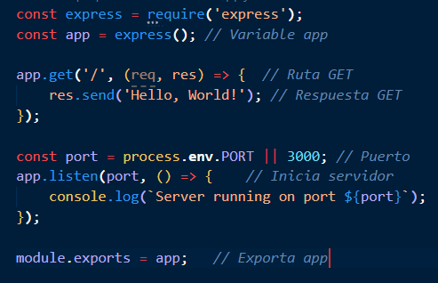


- Test Básico en js

```javascript
 tests/test.js
```
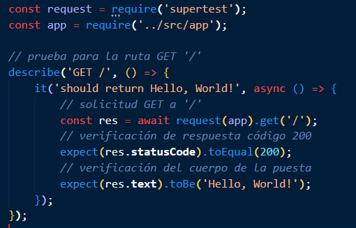

- Configuración de package.json

La configuración de este archivo define palabras clave que resuman acciones por ejemplo. Puedo correr el test mediante 

```javascript
 npx jest test.js  o
 npm test
```
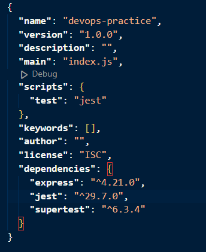

Resultado 

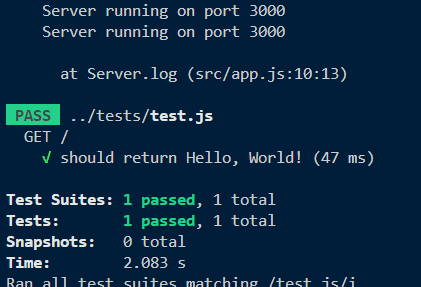

## 2. Pipeline CI/CD

### Parte 1 Configuración integración continua
- Estructura de proyecto 

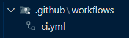


- Archivo ci.yml

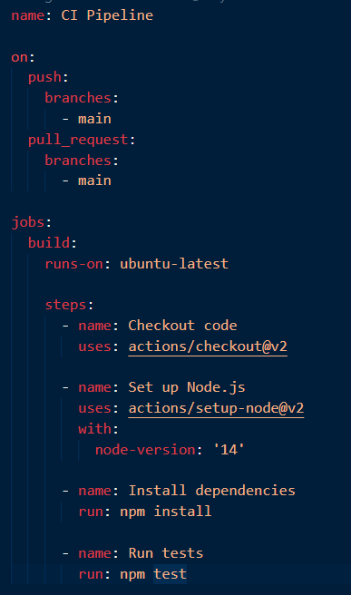

- Código a github

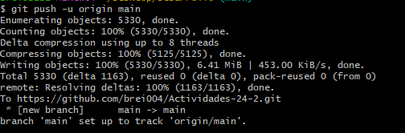

### Parte 2 Configuración entrega continua
- Creación de dockerfile

Necesitamos un Dockerfile para definir como se construirá la imagen Docker. Por ejemplo, el entorno donde trabajará y qué acciones realizará 

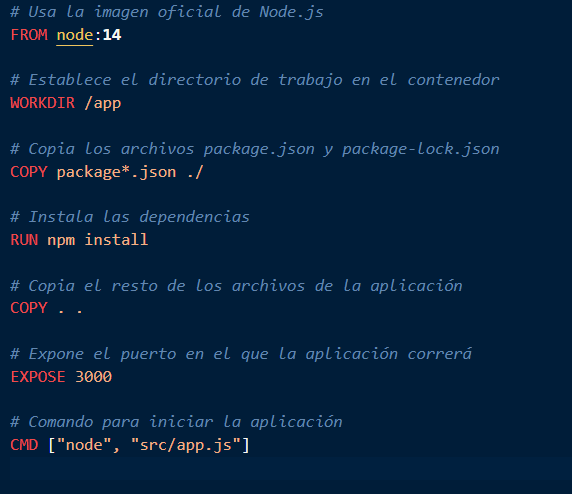

- Construcción de imagen docker

```javascript
docker build -t devops-practice
```


- Ejecución del imagen en contenedor

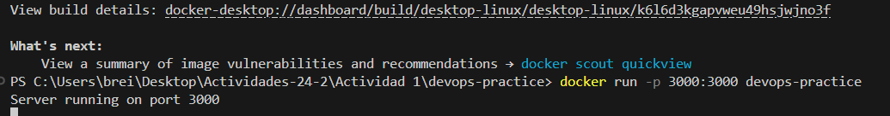

- Automatización con github actions


- Ejecución local 

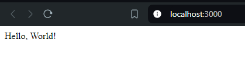