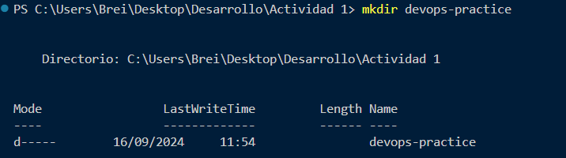

## 1. Configuración del entorno

Se busca la creación de una web sencilla, con una api rest básica

- Inicializamos el proyecto de node




con esto ya tenemos la base del proyecto de node

- Dependencias

Necesitamos la dependencia de express y jest para la creación de la api y pruebas respectivamente


- Carpetas del proyecto

Creamos la carpeta y subcarpetas para la actividad

 ```javascript
 mkdir src tests
```


```javascript
touch src/app.js tests/app.test.js
```

- Implementación de la API REST

```javascript
 src/app.js
```


- Test Básico en js

```javascript
 tests/test.js
```


- Configuración de package.json

La configuración de este archivo define palabras clave que resuman acciones por ejemplo. Puedo correr el test mediante 

```javascript
 npx jest test.js  o
 npm test
```


Resultado 


## 2. Pipeline CI/CD

- Estructura de proyecto 

