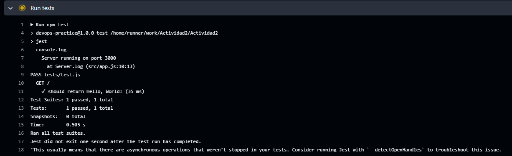
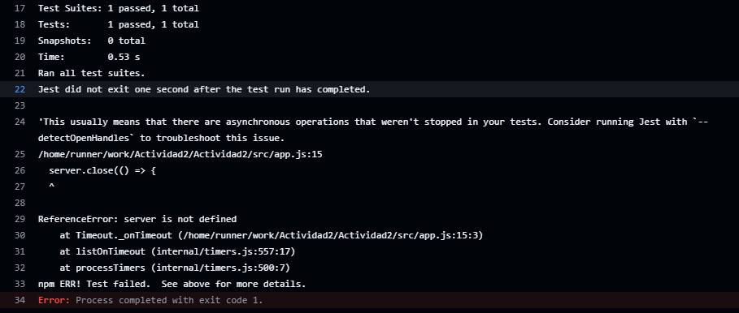

### **Pregunta 1: ¿Qué significa "desplazar a la izquierda" en el contexto de DevSecOps y por qué es importante?**

"Desplazar a la izquierda" en DevSecOps significa integrar la seguridad desde el inicio del ciclo de vida del desarrollo, no dejarlo como una fase final. Esto es crucial porque ayuda a detectar y corregir vulnerabilidades antes, cuando es más barato y sencillo. Además, permite que los desarrolladores se involucren en la seguridad desde el principio, lo que fortalece la calidad general del producto.

### **Pregunta 2: Explica cómo IaC mejora la consistencia y escalabilidad en la gestión de infraestructuras.**

La Infraestructura como Código (IaC) mejora la consistencia porque automatiza todo el proceso de aprovisionamiento. No importa cuántas veces se despliegue la infraestructura, siempre será igual porque está codificada. Esto también facilita la escalabilidad, ya que con solo ejecutar el código se pueden replicar infraestructuras en diferentes entornos, garantizando que todos los entornos sean idénticos sin intervención manual, lo que también minimiza errores.

### **Pregunta 3: ¿Cuál es la diferencia entre monitoreo y observabilidad? ¿Por qué es crucial la observabilidad en sistemas complejos?**

El monitoreo es más reactivo, se centra en recopilar datos y generar alertas cuando algo falla, mientras que la observabilidad es más proactiva. Te permite analizar y entender el comportamiento del sistema basándote en datos de logs, métricas y trazas. En sistemas complejos, la observabilidad es crucial porque los problemas no siempre son evidentes y, con tantos componentes interactuando, necesitas una visión profunda y dinámica para anticipar y resolver problemas antes de que escalen.

### **Pregunta 4: ¿Cómo puede la experiencia del desarrollador impactar el éxito de DevOps en una organización?**

La experiencia del desarrollador es fundamental para el éxito de DevOps porque cuando los desarrolladores tienen herramientas eficientes y procesos bien estructurados, su productividad mejora. Esto reduce los errores y hace que los ciclos de desarrollo y despliegue sean más rápidos. Además, si los desarrolladores se sienten apoyados y tienen una buena experiencia, su satisfacción laboral aumenta, lo que impacta positivamente en la calidad del trabajo.

### **Pregunta 5: Describe cómo InnerSource puede ayudar a reducir silos dentro de una organización.**

InnerSource ayuda a romper los silos porque fomenta la colaboración entre equipos que normalmente no interactuarían. Al adoptar prácticas de código abierto dentro de la empresa, cualquier persona puede contribuir a proyectos de otros equipos, lo que no solo enriquece los proyectos, sino que también promueve la transparencia y el intercambio de conocimientos. Esto elimina las barreras entre departamentos y mejora la cohesión en la organización.

### **Pregunta 6: ¿Qué rol juega la ingeniería de plataformas en mejorar la eficiencia y la experiencia del desarrollador?**

La ingeniería de plataformas es clave porque crea herramientas y servicios internos que los desarrolladores usan para automatizar tareas repetitivas y reducir la carga operativa. Esto les permite centrarse en lo que realmente importa: escribir código de calidad. Además, al estandarizar estos procesos, se reduce el tiempo de configuración y se mejora la consistencia, lo que a su vez mejora la experiencia de los desarrolladores y la eficiencia general del equipo.

### Configuración

El resto de la actividad es muy parecida a la activdad 1, así que solo se mostrará lo más destacable

Se agregaron los test

Sin embargo, se presentaron varios problemas. En CADA PUSH

Y era por incompatibilidad con la versión de NODE, así que se optó por usar la versión 16 

Finalmente con estas modificaciones podemos correr audit

Y el error de test es porque el servidor sigue esperando llamadas e hice un cambio para que en 5 segundos se cerrara la conexión

