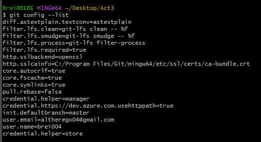
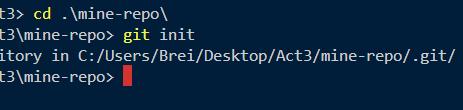
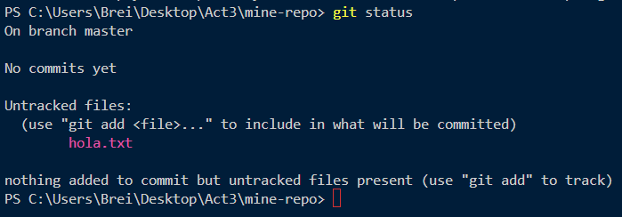
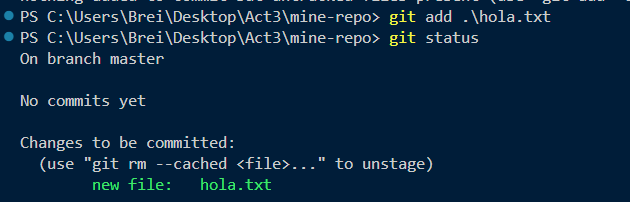
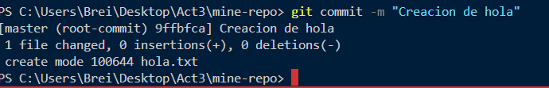
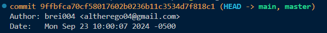

## Git config

Me permite visualizar la configuración actual de mi dispositivo

## Git init

Este comando me permite crea la carpeta .git la cual me permitirá tener un registro de versiones en mi rama local

- Creación de carpetas 

## Git add 

Este comando sirve para registrar que archivos queremos guardar sus cambios. Como si de un historial de ese archivo se tratara. 

Si creara un archivo y no le diera a git add <nombre> esto pasaría

## Git status

Este comando nos ayuda a revisar el estado de nuestros cambios en nuestras carpetas y que archivos no están siendo rastreados

## Git commit

Este comando permite que los archivos rastreados se guarden en el historial con el nombre especifico de este commit, como si de un punto de guardado se tratara

## Fases

Existen fases de trabajo en el uso de git

- Flujo de edición: Aquí se dan los cambios, edición, etc. En los que los archivos pueden sufrir distintas modificaciones

- Preparación: Aquí se indican que archivos queremos rastrear para su posterior registro con un commit

- Commit: Estos cambios son registrados con un hash, luego de todo el proceso anterior. Para su posterior publicación

## git log

Es te comando nos permite conocer el historial de commits, con el nombre que le dimos cada vez que hacíamos git commit

Nos muestra diferentes elementos, por ejemplo:

- Identificador SHA

- Detalles: Nombre y email de la persona

-  Marca de tiempo

Tambien tiene modificadores 

-p : nos muestra el cambio nuevo en cada commit
--stat : nos abrevia algunas estadistica
--oneline: Minimiza la salida de información
--graph: Muestra la salida tipo un arbol con ramas
 --author <author>: Filtra los commits hechos por el author indicado
