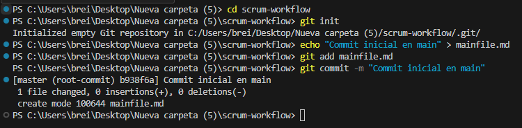
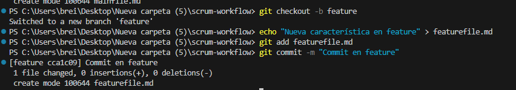
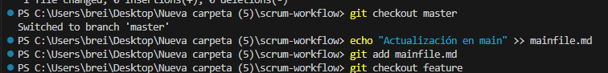
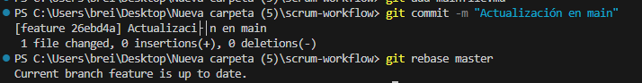
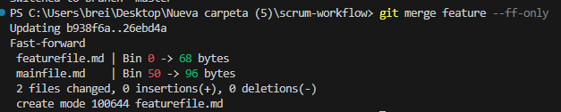
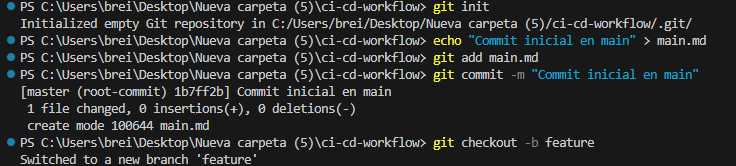
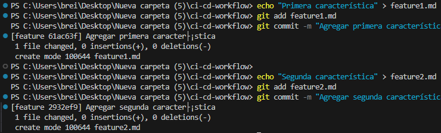
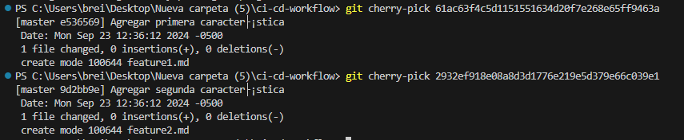

## Diferencias entre git merge y git rebase

- git merge: Combina el trabajo de dos ramas y crea un commit de fusión. Mantiene el historial de las dos ramas independientes.
- Ventaja: Mantiene el historial completo de cambios, útil para rastrear cuándo y cómo se desarrollaron características.
- Desventaja: Puede generar un historial complejo con muchos commits de fusión.
- git rebase: Mueve los commits de una rama a la base de otra. Da como resultado un historial lineal sin commits de fusión.
- Ventaja: Simplifica el historial y facilita la comprensión de los cambios.
- Desventaja: Si se usa en una rama compartida, puede causar problemas para otros colaboradores.

## Relación entre git rebase y DevOps

git rebase es útil en DevOps porque:

- Historial limpio: Facilita el rastreo de cambios, lo que es esencial en CI/CD.
- Menos conflictos: Mantiene la base de código alineada, reduciendo los conflictos durante la integración continua.
- Automatización: Puede ser automatizado en pipelines de CI/CD para asegurar que todas las ramas de características se mantengan actualizadas con main antes de hacer push.

## Impacto del git cherry-pick en un equipo Scrum
El cherry-pick es útil cuando solo necesitas integrar commits específicos sin hacer merge de una rama completa. En un equipo Scrum, puede ser valioso al final de un sprint, cuando solo algunos cambios están listos para ser integrados en producción.

## Ejercicios

### pregunta: 
¿Qué sucede con el historial después del rebase?

- El historial se vuelve lineal, como si los cambios de feature se hubieran hecho directamente sobre main.
### Pregunta: ¿Cuándo aplicarías una fusión fast-forward?

- En situaciones donde no es necesario mantener ramas separadas para mejorar la claridad del historial.

## CD CI

### Haciendo 2 cherry pick 

- Pregunta: ¿Cómo utilizarías cherry-pick en CI/CD?

Para mover solo los commits listos para producción, sin mezclar otros que estén en desarrollo.

